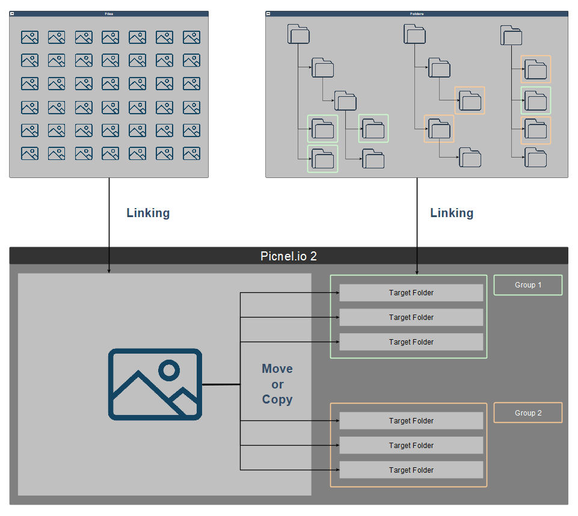
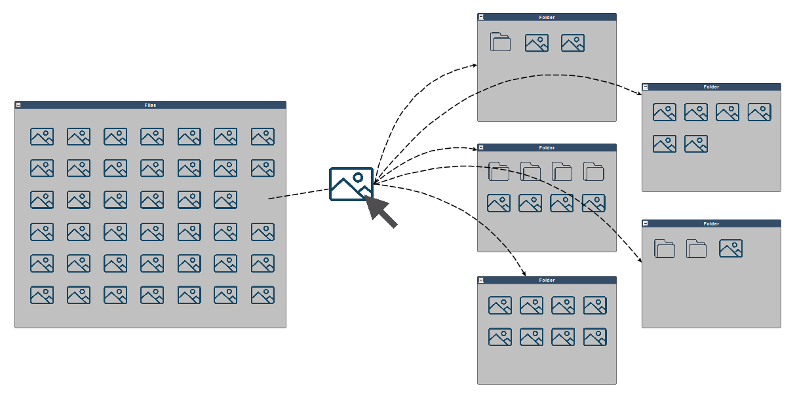

# Introduction

## Why developed Picnel.io 2
There are already many image classification software on the market, the more well-known ones may be [Eagle](https://tw.eagle.cool), [Tiat](https://tiat.app), these are very mature and excellent Software. But you will find that they only perform a kind of virtual classification management in the software. In fact, your real files are not organized, and they are still scattered in every corner of your computer. At the same time, you must store some database files for these software. Record the virtual categories in your software since.

## What Picnel.io can do
You can import and preview files containing a large number of uncategorized pictures, videos, and music folders. At the same time, users can import folders scattered at various depth levels into Picnel.io to create links (shortcuts), and you can Create groups in the software to classify the imported folders.
In this way, while previewing the file, the user can easily use the folder link (shortcut) just created to copy/move the file to the folder.

### Picnel.io 2

### Traditional way
In normal, we have to open a lot of folder windows, and constantly drag/cut & paste files to move classified files.
This is a very inefficient way, and very tiring and irritating. Think about it if you have hundreds of folders and files...

It can be seen that Pocnel.io 2 actually extracts and flatten different levels of folders to the same level. In this way, you don't need to open many folder windows, and find folders more quickly and easily. All operations can be completed quickly in one window, greatly improving efficiency.